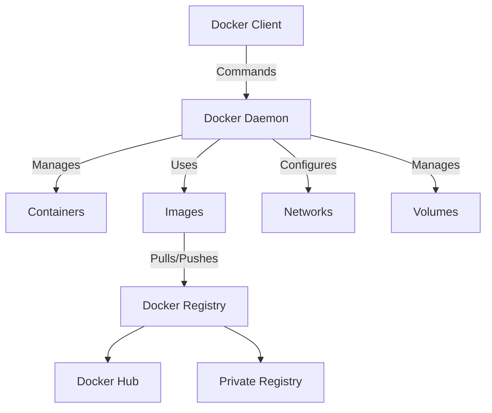
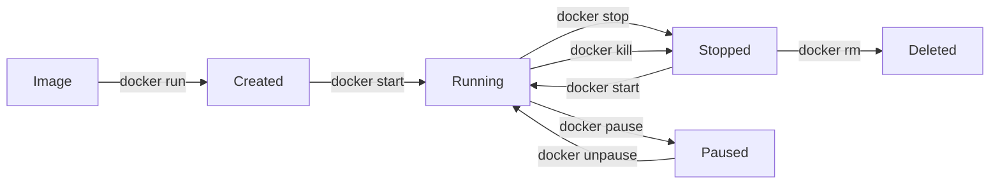
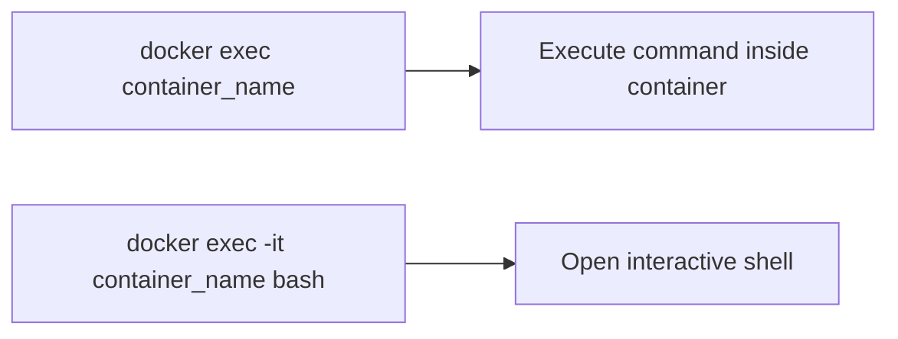
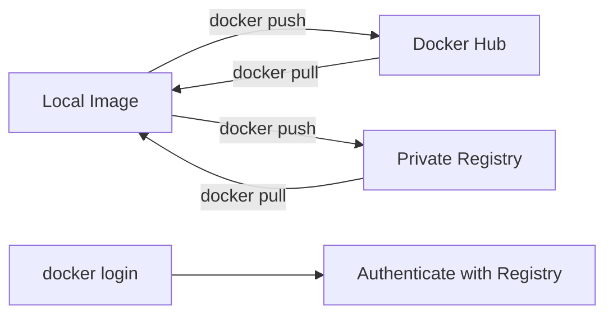
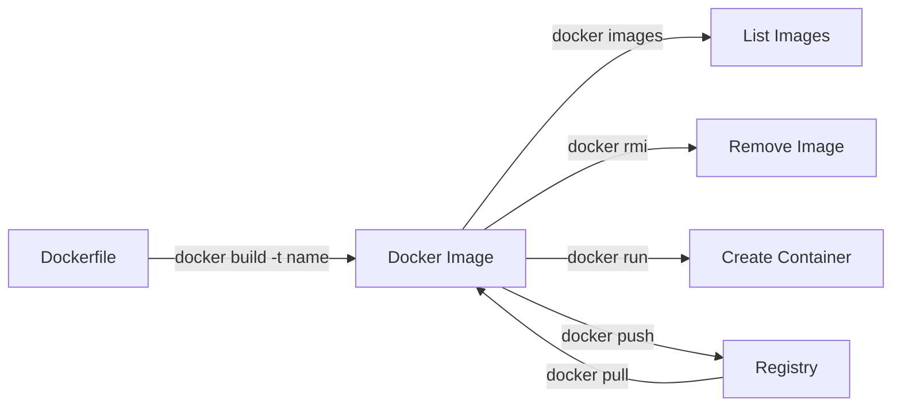
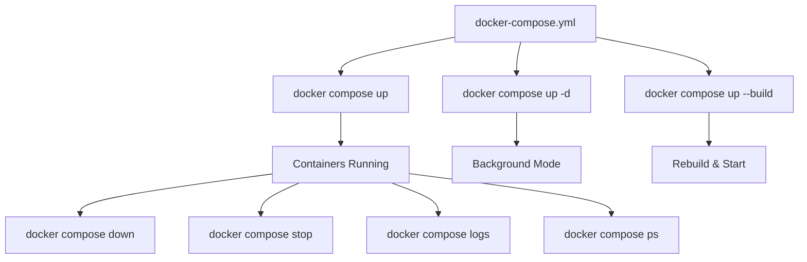
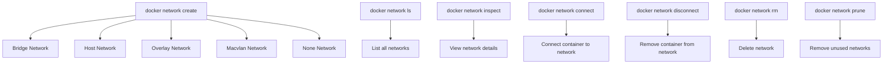
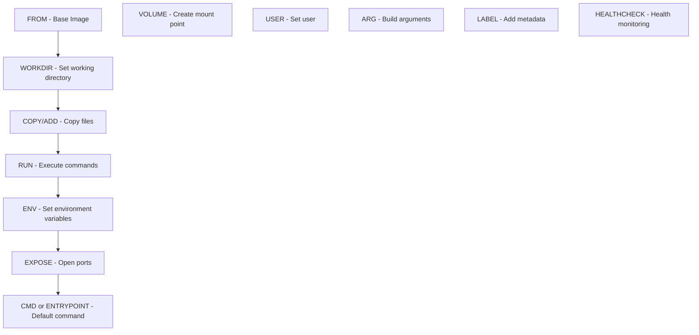
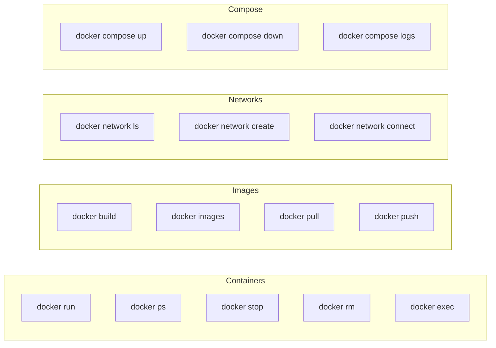

# Docker CheatSheet for DevOps Engineers

A comprehensive cheatsheet covering Docker installation, container management, images, networking, Docker Compose, Dockerfiles, and more.

---

## Installation & Account Setup

| Resource | Link |
|----------|------|
| Docker (Linux) | https://docs.docker.com/engine/install/ |
| Docker Desktop (Linux, Windows, Mac) | https://docs.docker.com/desktop/ |

---

## Docker Architecture



---

## Docker Container Lifecycle



---

## Docker Container Commands

| Command | Description |
|---------|-------------|
| `docker run <tr>` | Create and run a new container |
| `docker run -d <tr>` | Run a container in the background |
| `docker run -p 8080:80 <tr>` | Publish container port 80 to host port 8080 |
| `docker run -v <host>:<container> <tr>` | Mount a host directory to a container |
| `docker ps` | List currently running containers |
| `docker ps --all` | List all containers (running or stopped) |
| `docker logs <container_name>` | Fetch the logs of a container |
| `docker logs -f <container_name>` | Fetch and follow the logs of a container |
| `docker stop <container_name>` | Stop a running container |
| `docker start <container_name>` | Start a stopped container |
| `docker rm <container_name>` | Remove a container |

---

## Executing Commands in Docker Container



| Command | Description |
|---------|-------------|
| `docker exec <container_name> <command>` | Execute a command in a running container |
| `docker exec -it <container_name> bash` | Open a shell in a running container |

---

## Docker Container Registry Commands



| Command | Description |
|---------|-------------|
| `docker login` | Login to Docker Hub |
| `docker logout` | Logout of Docker Hub |
| `docker login <server>` | Login to another container registry |
| `docker logout <server>` | Logout of another container registry |
| `docker push </tr>` | Upload an image to a registry |
| `docker search <tr>` | Search Docker Hub for images |
| `docker pull <tr>` | Download an image from a registry |

---

## Docker Image Commands



| Command | Description |
|---------|-------------|
| `docker build -t </table>` | Build a new image from the Dockerfile in the current directory and tag it |
| `docker images` | List local images |
| `docker rmi <tr>` | Remove an image |

---

## Docker System Commands

| Command | Description |
|---------|-------------|
| `docker system df` | Show Docker disk usage |
| `docker system prune` | Remove unused data |
| `docker system prune -a` | Remove all unused data |

---

## Docker Compose Commands



| Command | Description |
|---------|-------------|
| `docker compose up` | Create and start containers |
| `docker compose up -d` | Create and start containers in background |
| `docker compose up --build` | Rebuild images before starting containers |
| `docker compose stop` | Stop services |
| `docker compose down` | Stop and remove containers and networks |
| `docker compose ps` | List running containers |
| `docker compose logs` | View the logs of all containers |
| `docker compose logs <service>` | View the logs of a specific service |
| `docker compose logs -f` | View and follow the logs |
| `docker compose build` | Build or rebuild services |
| `docker compose pull` | Pull the latest images |
| `docker compose build --pull` | Pull latest images before building |

---

## Docker Network Management



### Network Commands

| Command | Description |
|---------|-------------|
| `docker network create --driver <driver_name> <network_name>` | Create docker network with custom driver |
| `docker network connect <network_name> <container_name>` | Connect a running container to an existing network |
| `docker network inspect <network_name>` | Get details of a Docker network |
| `docker network ls` | List all the Docker networks |
| `docker network disconnect <network_name> <container_name>` | Remove a container from the network |
| `docker network rm <network_name>` | Remove a Docker network |
| `docker network prune` | Remove all unused Docker networks |

---

## Dockerfile Instructions



### Dockerfile Instructions Table

| Instruction | Description |
|-------------|-------------|
| `FROM <tr>` | Set the base image |
| `FROM </td> AS <name>` | Set the base image and name the build stage |
| `RUN <command>` | Execute a command as part of the build process |
| `RUN ["exec", "param1", "param2"]` | Execute a command as part of the build process |
| `CMD ["exec", "param1", "param2"]` | Execute a command when the container starts |
| `ENTRYPOINT ["exec", "param1"]` | Configure the container to run as an executable |
| `ENV <key>=<value>` | Set an environment variable |
| `EXPOSE <port>` | Expose a port |
| `COPY <src> <dest>` | Copy files from source to destination |
| `COPY --from=<name> <src> <dest>` | Copy files from a build stage to destination |
| `WORKDIR <path>` | Set the working directory |
| `VOLUME <path>` | Create a mount point |
| `USER <user>` | Set the user |
| `ARG <name>` | Define a build argument |
| `ARG <name>=<default>` | Define a build argument with a default value |
| `LABEL <key>=<value>` | Set a metadata label |
| `HEALTHCHECK <command>` | Set a healthcheck command |

---

## Docker Scout Commands

| Command | Description |
|---------|-------------|
| `docker scout` | Command-line tool for Docker Scout |
| `docker scout quickview` | Quick overview of an image |
| `docker scout compare` | Compare two images and display differences |
| `docker scout recommendations` | Display available base image updates and remediation recommendations |
| `docker scout recommendations <image_name>` | Display base image update recommendations |
| `docker scout compare --to <image_name>:latest <image_name>:v1.2.3-pre` | Compare an image to the latest tag |

---

## Quick Command Reference



---

## Most Useful Commands - Quick List

```bash
# Container Management
docker ps -a                    # List all containers
docker stop $(docker ps -aq)    # Stop all containers
docker rm $(docker ps -aq)      # Remove all containers

# Image Management
docker images                   # List all images
docker rmi $(docker images -q)  # Remove all images
docker system prune -a          # Clean everything unused

# Logs
docker logs -f container_name   # Follow logs
docker logs --tail 100 container_name  # Last 100 lines

# Execute
docker exec -it container_name bash     # Open bash shell
docker exec container_name ls -la       # Run single command

# Build
docker build -t myapp:latest .          # Build image
docker build --no-cache -t myapp .      # Build without cache
```

---

> **Pro Tip**: Use `docker --help` or `docker <command> --help` to get detailed information about any command directly from the terminal.

*Reference: Docker CheatSheet for DevOps Engineers*
