# Docker Networking - Complete Reference Guide

Docker networking enables containers to communicate with each other and with external systems. Docker provides several network types to suit different use cases.

---

## Docker Network Architecture Overview

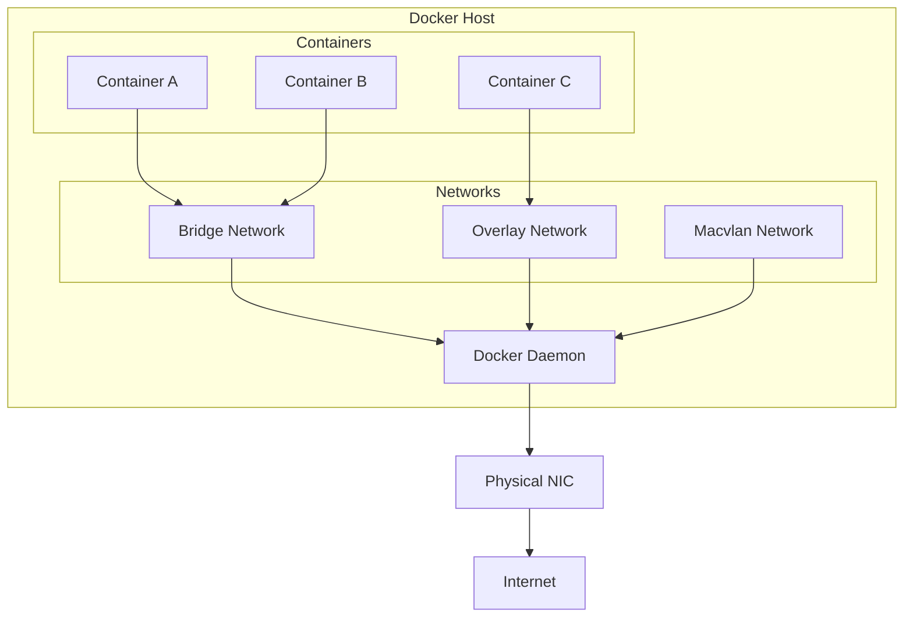

---

## 1. Default Bridge Network

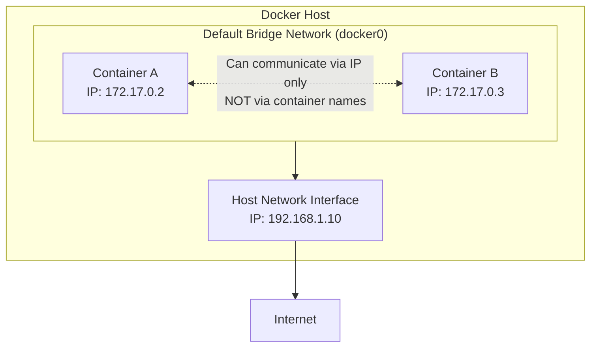

**Command:**
```bash
docker run --network=bridge my-container
```

**Key Points:**
- Default network mode
- Private network on host machine
- Containers communicate via IP addresses (NOT container names)
- Automatic IP assignment

---

## 2. Host Network

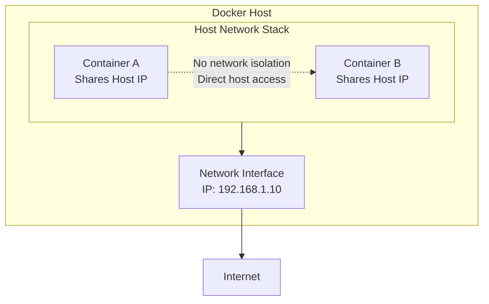

**Command:**
```bash
docker run --network=host my-container
```

**Key Points:**
- Shares host's network stack
- No port mapping required
- Best for performance-critical apps
- No network isolation

---

## 3. Overlay Network (Multi-Host)

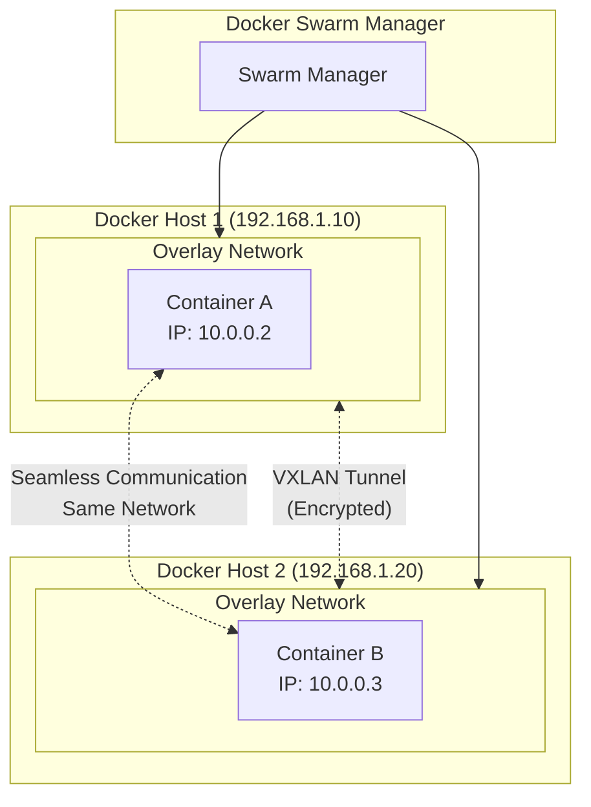

**Commands:**
```bash
# Initialize Swarm mode first
docker swarm init

# Create overlay network
docker network create --driver=overlay my-overlay-network

# Deploy service with overlay network
docker service create --network=my-overlay-network my-service
```

**Key Points:**
- Connects containers across multiple hosts
- Uses VXLAN encapsulation
- Requires Docker Swarm mode
- Built-in encryption option

---

## 4. Macvlan Network

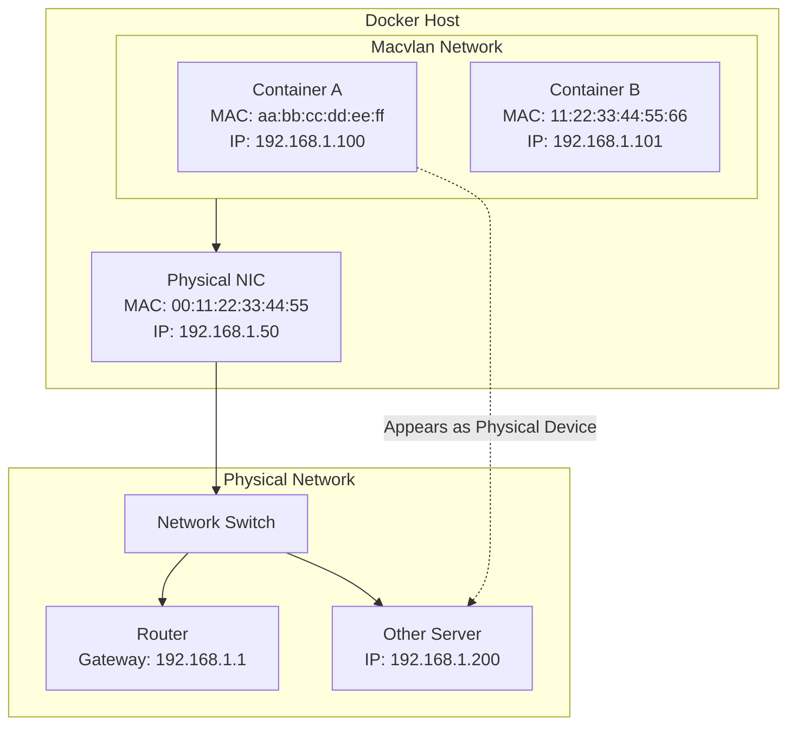

**Command:**
```bash
docker network create -d macvlan \
  --subnet=192.168.1.0/24 \
  --gateway=192.168.1.1 \
  -o parent=eth0 \
  my-macvlan-network

docker run --network=my-macvlan-network my-container
```

**Key Points:**
- Each container gets its own MAC address
- Containers appear as physical devices on network
- Direct Layer 2 network access
- Useful for legacy applications

---

## 5. Custom Bridge Network (Recommended)

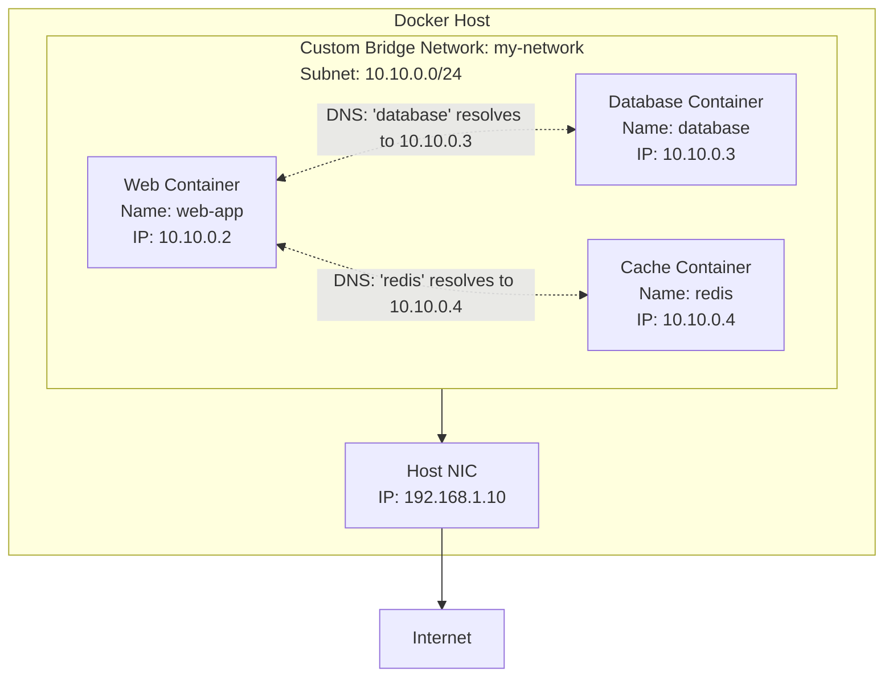

**Commands:**
```bash
# Create custom bridge network
docker network create my-network

# Run containers on the network
docker run -d --name web-app --network my-network nginx
docker run -d --name database --network my-network postgres
docker run -d --name redis --network my-network redis

# Now web-app can ping database by name!
```

**Key Points:**
- User-defined private network
- **Automatic DNS resolution between containers**
- Better isolation than default bridge
- Containers can reach each other by container name

---

## 6. None Network (Fully Isolated)

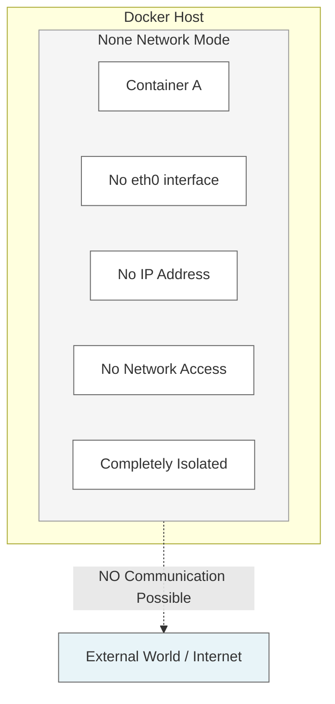

**Command:**
```bash
docker run --network=none my-container
```

**Key Points:**
- Complete network isolation
- No network interfaces at all
- No incoming or outgoing traffic
- Maximum security for sensitive workloads
- Perfect for batch jobs or offline processing

---

## Network Selection Guide

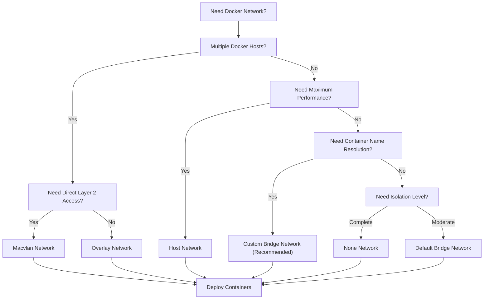

---

## Comparison Table

| Network Type | Use Case | Isolation | Multi-Host | DNS Resolution | Performance |
|--------------|----------|-----------|------------|----------------|-------------|
| **Default Bridge** | Basic single-host | Moderate | No | No | Medium |
| **Host Network** | Performance critical | None | No | N/A | High |
| **Overlay Network** | Multi-host services | High | Yes | Yes | Medium |
| **Macvlan Network** | Legacy/L2 access | Low | Yes | No | High |
| **Custom Bridge** | Production apps | Moderate | No | Yes | Medium |
| **None Network** | Security sensitive | Complete | No | N/A | N/A |

---

## Network Communication Flow Example

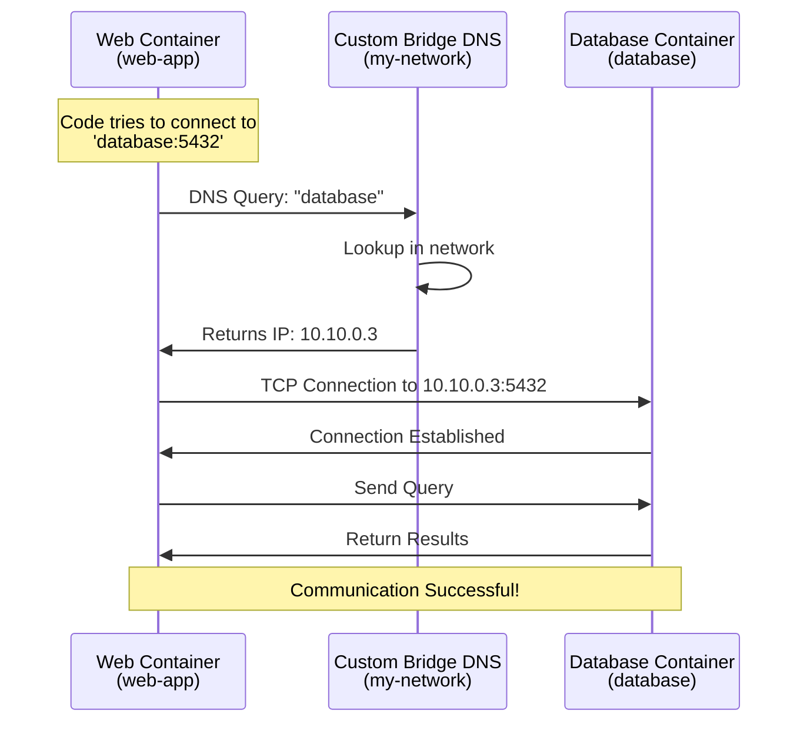

---

## Network Management Commands

```bash
# List all networks
docker network ls

# Inspect a network (shows configuration and connected containers)
docker network inspect <network_name>

# Create custom bridge network
docker network create my-network

# Create network with specific subnet
docker network create --subnet=10.10.0.0/24 my-network

# Create overlay network (requires Swarm)
docker network create --driver=overlay my-overlay-network

# Create macvlan network
docker network create -d macvlan --subnet=192.168.1.0/24 --gateway=192.168.1.1 -o parent=eth0 my-macvlan

# Connect a running container to a network
docker network connect <network_name> <container_name>

# Disconnect a container from a network
docker network disconnect <network_name> <container_name>

# Remove a network
docker network rm <network_name>

# Remove all unused networks
docker network prune
```

---

## Best Practices

### Do's ✅
- Use **Custom Bridge Networks** for production applications
- Use **Overlay Networks** for multi-host setups
- Use descriptive network names (e.g., `prod-frontend`, `dev-database`)
- Regularly prune unused networks with `docker network prune`
- Use `docker network inspect` to debug connectivity issues

### Don'ts ❌
- Don't use Default Bridge for production (no DNS resolution)
- Don't use Host Network unless absolutely necessary
- Don't create too many unused networks
- Don't forget to cleanup after testing

---

## Common Scenarios

### Scenario 1: Web Application with Database
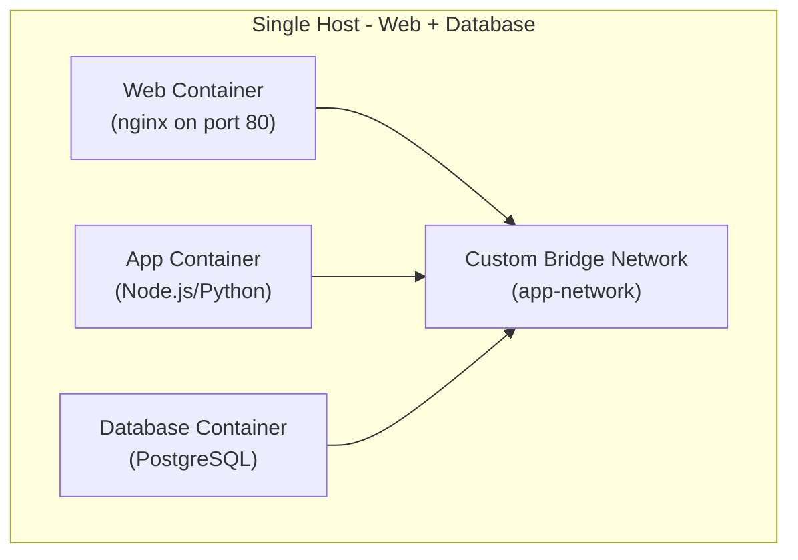

### Scenario 2: Multi-Host Microservices
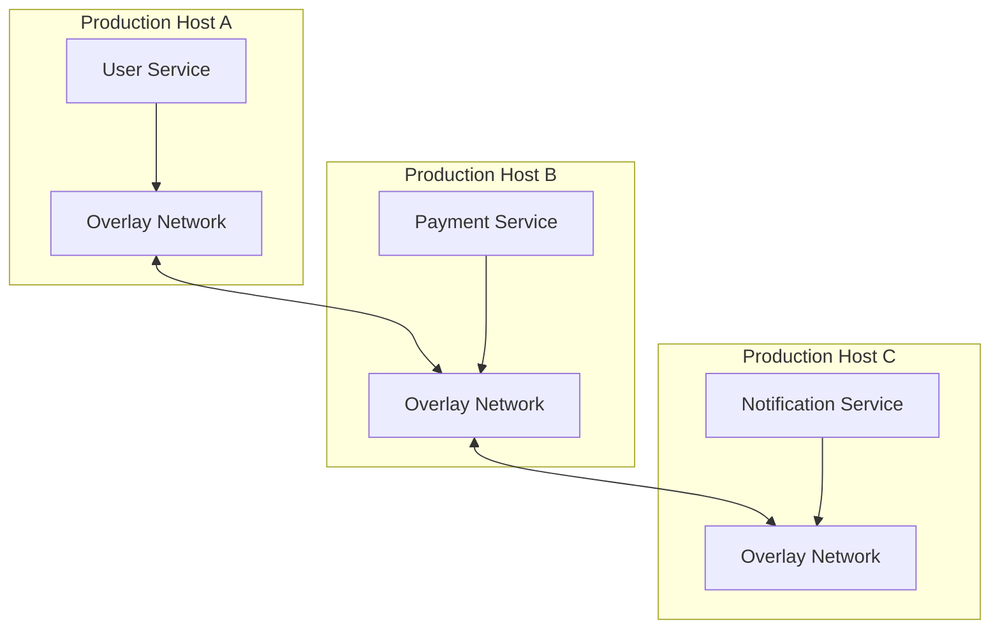

---

## Troubleshooting Common Issues

| Issue | Solution |
|-------|----------|
| Containers can't ping each other by name | Use Custom Bridge Network instead of Default Bridge |
| Port already in use | Use different host port: `-p 8081:80` |
| Can't communicate between hosts | Use Overlay Network with Docker Swarm |
| Container has no internet | Check if network has `--internal` flag |
| Macvlan not working | Ensure parent interface name is correct (`eth0`, `ens33`, etc.) |

---

> **Important Note**: Default bridge network does NOT support automatic DNS resolution between containers. Always use **Custom Bridge Networks** for container name-based communication in production.

*Reference: Docker Networking Notes for DevOps Engineers*
