<div align="center">

# ☸️ Kubernetes — Complete Notes
### For DevOps Engineers & CKA Preparation


> **Kubernetes** is an open-source container orchestration platform that automates deployment, scaling, and load balancing of containerized applications.

</div>

---

## 📚 Table of Contents

| # | Topic |
|---|-------|
| 1 | [History & Overview](#-history--overview) |
| 2 | [Features](#-features) |
| 3 | [Cluster Architecture](#-cluster-architecture) |
| 4 | [Control Plane Deep Dive](#-control-plane-deep-dive) |
| 5 | [Node Components](#-node-components) |
| 6 | [Pods](#-pods) |
| 7 | [Deployments & Rollback](#-deployments--rollback) |
| 8 | [Services](#-services) |
| 9 | [Ingress](#-ingress) |
| 10 | [Scaling & ReplicaSets](#-scaling--replicasets) |
| 11 | [Networking](#-kubernetes-networking) |
| 12 | [Volumes & Storage](#-volumes--storage) |
| 13 | [Persistent Volumes](#-persistent-volumes) |
| 14 | [Namespaces](#-namespaces) |
| 15 | [Labels & Selectors](#-labels--selectors) |
| 16 | [Secrets & ConfigMaps](#-secrets--configmaps) |
| 17 | [Pod Lifecycle](#-pod-lifecycle) |
| 18 | [Kubernetes Objects](#-kubernetes-objects) |
| 19 | [Helm CheatSheet](#-helm-cheatsheet) |
| 20 | [kubectl Quick Reference](#-kubectl-quick-reference) |

---

## 🕰️ History & Overview

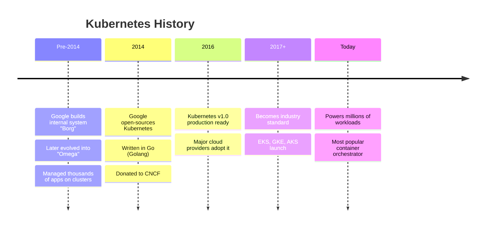
```mermaid
timeline
    title Kubernetes History
    Pre-2014 : Google builds internal system "Borg"
             : Later evolved into "Omega"
             : Managed thousands of apps on clusters
    2014     : Google open-sources Kubernetes
             : Written in Go (Golang)
             : Donated to CNCF
    2016     : Kubernetes v1.0 production ready
             : Major cloud providers adopt it
    2017+    : Becomes industry standard
             : EKS, GKE, AKS launch
    Today    : Powers millions of workloads
             : Most popular container orchestrator
```

> 💡 **K8s** = Kubernetes (8 letters between K and s)
> All top cloud providers support Kubernetes: **AWS (EKS)**, **GCP (GKE)**, **Azure (AKS)**

---

## ✨ Features

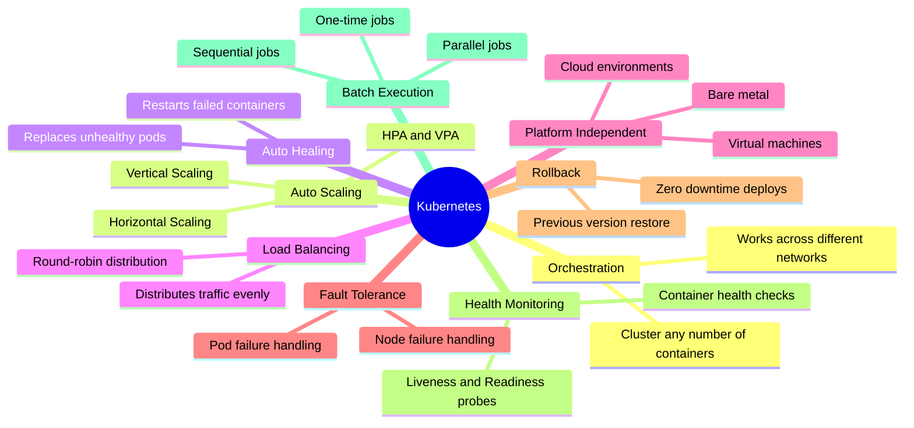
```mermaid
mindmap
  root((Kubernetes))
    Orchestration
      Cluster any number of containers
      Works across different networks
    Auto Scaling
      Vertical Scaling
      Horizontal Scaling
      HPA and VPA
    Auto Healing
      Restarts failed containers
      Replaces unhealthy pods
    Load Balancing
      Distributes traffic evenly
      Round-robin distribution
    Platform Independent
      Cloud environments
      Virtual machines
      Bare metal
    Fault Tolerance
      Node failure handling
      Pod failure handling
    Rollback
      Previous version restore
      Zero downtime deploys
    Health Monitoring
      Container health checks
      Liveness and Readiness probes
    Batch Execution
      One-time jobs
      Sequential jobs
      Parallel jobs
```

---

## 🏗️ Cluster Architecture

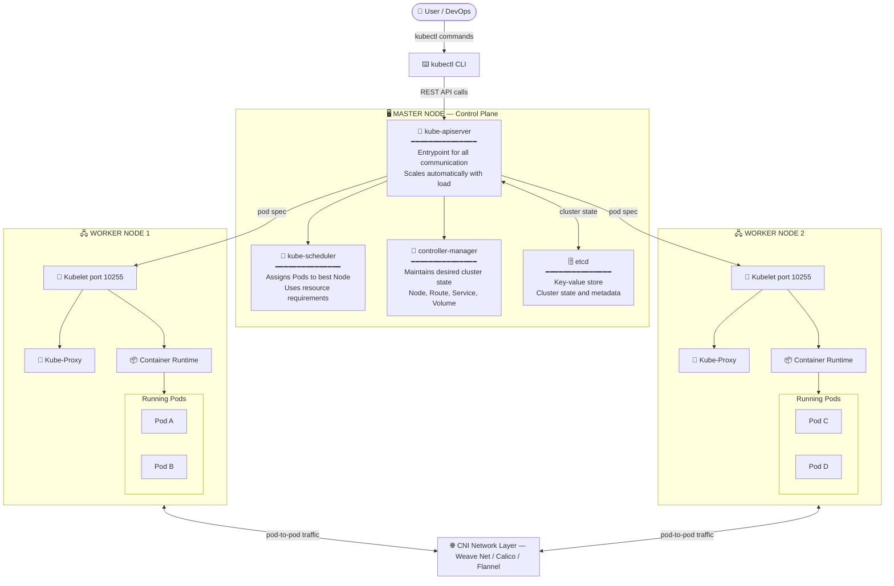
```mermaid
graph TB
    User(["👤 User / DevOps"])
    kubectl["⌨️ kubectl CLI"]

    subgraph Master["🖥️ MASTER NODE — Control Plane"]
        direction TB
        API["🔌 kube-apiserver\n━━━━━━━━━━━━━━━\nEntrypoint for all communication\nScales automatically with load"]
        SCHED["📅 kube-scheduler\n━━━━━━━━━━━━━━━\nAssigns Pods to best Node\nUses resource requirements"]
        CM["🔁 controller-manager\n━━━━━━━━━━━━━━━\nMaintains desired cluster state\nNode, Route, Service, Volume"]
        ETCD["🗄️ etcd\n━━━━━━━━━━━━━━━\nKey-value store\nCluster state and metadata"]
    end

    subgraph Node1["🖧 WORKER NODE 1"]
        KL1["🤖 Kubelet  port 10255"]
        KP1["🔀 Kube-Proxy"]
        CE1["📦 Container Runtime"]
        subgraph Pods1["Running Pods"]
            P1["Pod A"]
            P2["Pod B"]
        end
    end

    subgraph Node2["🖧 WORKER NODE 2"]
        KL2["🤖 Kubelet  port 10255"]
        KP2["🔀 Kube-Proxy"]
        CE2["📦 Container Runtime"]
        subgraph Pods2["Running Pods"]
            P3["Pod C"]
            P4["Pod D"]
        end
    end

    subgraph CNI["🌐 CNI Network Layer — Weave Net / Calico / Flannel"]
    end

    User -->|"kubectl commands"| kubectl
    kubectl -->|"REST API calls"| API
    API <-->|"cluster state"| ETCD
    API --> SCHED
    API --> CM
    API -->|"pod spec"| KL1
    API -->|"pod spec"| KL2
    KL1 --> CE1 --> Pods1
    KL1 --> KP1
    KL2 --> CE2 --> Pods2
    KL2 --> KP2
    Node1 <-->|"pod-to-pod traffic"| CNI
    Node2 <-->|"pod-to-pod traffic"| CNI
```

> 🔑 **How to work with Kubernetes:**
> 1. Write a **Manifest (.yml)** describing desired state
> 2. `kubectl apply -f manifest.yml` → sent to API server
> 3. Control plane schedules and runs pods on worker nodes

---

## 🧠 Control Plane Deep Dive

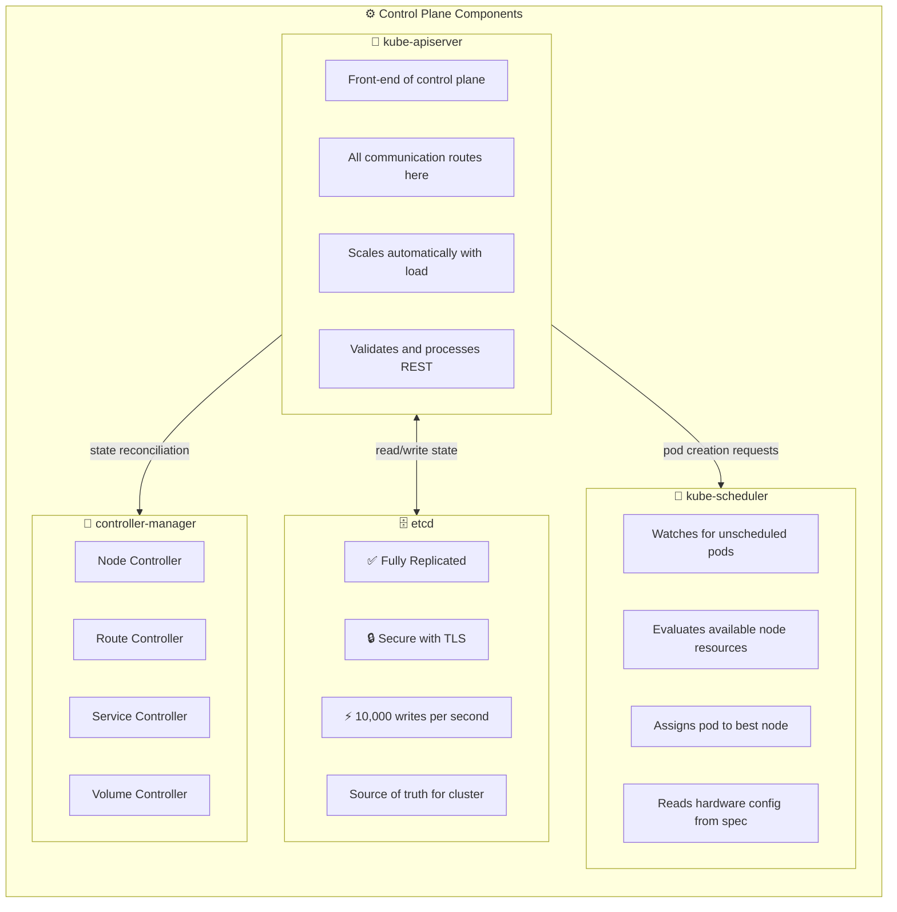
```mermaid
flowchart LR
    subgraph CP["⚙️ Control Plane Components"]
        direction TB

        subgraph API_BOX["🔌 kube-apiserver"]
            A1["Front-end of control plane"]
            A2["All communication routes here"]
            A3["Scales automatically with load"]
            A4["Validates and processes REST"]
        end

        subgraph ETCD_BOX["🗄️ etcd"]
            E1["✅ Fully Replicated"]
            E2["🔒 Secure with TLS"]
            E3["⚡ 10,000 writes per second"]
            E4["Source of truth for cluster"]
        end

        subgraph SCHED_BOX["📅 kube-scheduler"]
            S1["Watches for unscheduled pods"]
            S2["Evaluates available node resources"]
            S3["Assigns pod to best node"]
            S4["Reads hardware config from spec"]
        end

        subgraph CM_BOX["🔁 controller-manager"]
            NC["Node Controller"]
            RC["Route Controller"]
            SC["Service Controller"]
            VC["Volume Controller"]
        end
    end

    API_BOX <-->|"read/write state"| ETCD_BOX
    API_BOX -->|"pod creation requests"| SCHED_BOX
    API_BOX -->|"state reconciliation"| CM_BOX
```

### etcd Properties

| Property | Detail |
|----------|--------|
| **Type** | Distributed key-value store |
| **Fully Replicated** | Entire cluster state available on every node |
| **Secure** | Automatic TLS + optional client certificates |
| **Performance** | **10,000 writes/second** |
| **Purpose** | Single source of truth for cluster state |
| **Data stored** | Pod specs, secrets, configmaps, node info |

### Controller Types

| Controller | Responsibility |
|------------|---------------|
| **Node Controller** | Detects node failure in cloud |
| **Route Controller** | Sets up network routes on cloud |
| **Service Controller** | Manages cloud load balancers |
| **Volume Controller** | Creates, attaches, mounts cloud volumes |

---

## ⚙️ Node Components

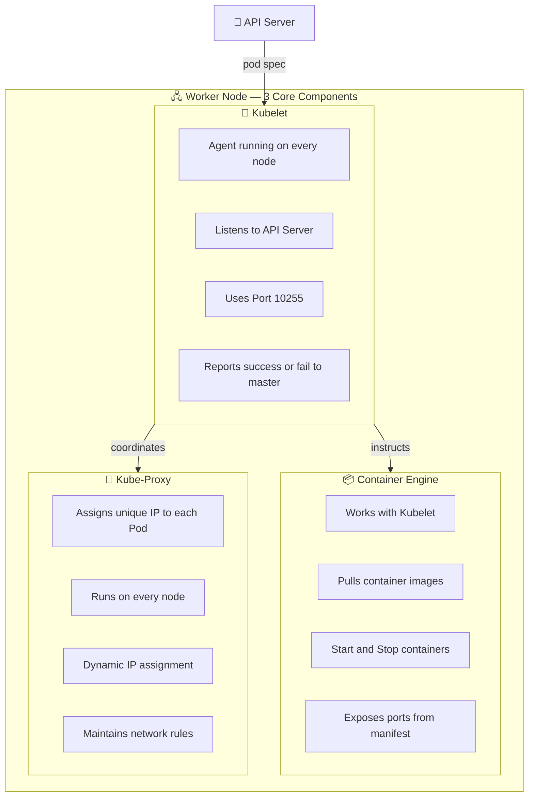
```mermaid
graph TB
    API["🔌 API Server"]

    subgraph WN["🖧 Worker Node — 3 Core Components"]
        direction LR

        subgraph KL["🤖 Kubelet"]
            KL1["Agent running on every node"]
            KL2["Listens to API Server"]
            KL3["Uses Port 10255"]
            KL4["Reports success or fail to master"]
        end

        subgraph CE["📦 Container Engine"]
            CE1["Works with Kubelet"]
            CE2["Pulls container images"]
            CE3["Start and Stop containers"]
            CE4["Exposes ports from manifest"]
        end

        subgraph KP["🔀 Kube-Proxy"]
            KP1["Assigns unique IP to each Pod"]
            KP2["Runs on every node"]
            KP3["Dynamic IP assignment"]
            KP4["Maintains network rules"]
        end
    end

    API -->|"pod spec"| KL
    KL -->|"instructs"| CE
    KL -->|"coordinates"| KP
```

---

## 🟦 Pods

> Kubernetes **never deploys containers directly** — they are always encapsulated inside **Pods**.

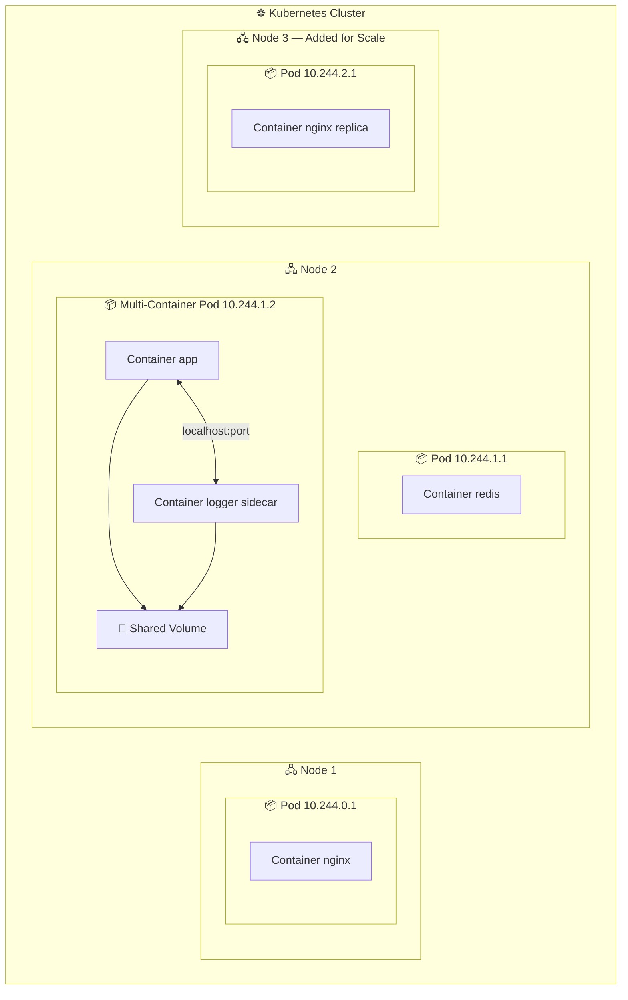
```mermaid
graph TB
    subgraph Cluster["☸️ Kubernetes Cluster"]
        direction LR

        subgraph N1["🖧 Node 1"]
            subgraph P1["📦 Pod  10.244.0.1"]
                C1["Container nginx"]
            end
        end

        subgraph N2["🖧 Node 2"]
            subgraph P2["📦 Pod  10.244.1.1"]
                C2["Container redis"]
            end
            subgraph P3["📦 Multi-Container Pod  10.244.1.2"]
                C3["Container app"]
                C4["Container logger sidecar"]
                SV["📁 Shared Volume"]
            end
        end

        subgraph N3["🖧 Node 3 — Added for Scale"]
            subgraph P4["📦 Pod  10.244.2.1"]
                C5["Container nginx replica"]
            end
        end
    end

    C3 <-->|"localhost:port"| C4
    C3 --> SV
    C4 --> SV
```

### Pod Key Facts

| Property | Description |
|----------|-------------|
| **Smallest unit** | Smallest deployable object in Kubernetes |
| **IP Address** | Each Pod gets a **unique IP address** |
| **Scaling** | New Pod created when horizontal scaling needed |
| **New Node** | New Node added to cluster for further scaling |
| **Control unit** | K8s controls Pods — NOT individual containers |
| **Default** | One Pod → One Container (recommended pattern) |
| **No auto-heal** | Bare Pods have no auto-healing — use Deployments |

### Multi-Container Pod

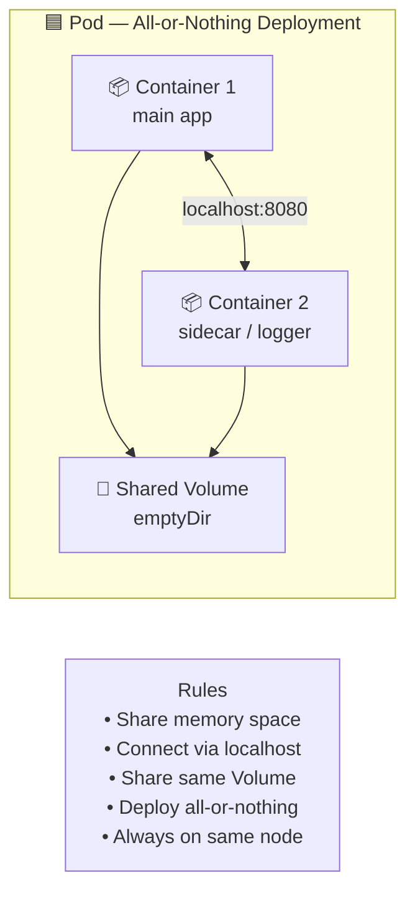
```mermaid
graph LR
    subgraph Pod["🟦 Pod — All-or-Nothing Deployment"]
        C1["📦 Container 1\nmain app"]
        C2["📦 Container 2\nsidecar / logger"]
        V["📁 Shared Volume\nemptyDir"]
    end

    C1 <-->|"localhost:8080"| C2
    C1 --> V
    C2 --> V

    Rules["Rules\n• Share memory space\n• Connect via localhost\n• Share same Volume\n• Deploy all-or-nothing\n• Always on same node"]
```

### Pod Manifest

```yaml
# my-apache-pod.yaml
apiVersion: v1          # API version
kind: Pod               # Resource type
metadata:               # Resource metadata
  name: apache-pod
  labels:
    app: web
    env: production
spec:                   # Desired behavior
  containers:
    - name: apache-container
      image: httpd:2.4
      ports:
        - containerPort: 80
      resources:
        requests:
          memory: "64Mi"
          cpu: "250m"
        limits:
          memory: "128Mi"
          cpu: "500m"
```

---

## 🚀 Deployments & Rollback

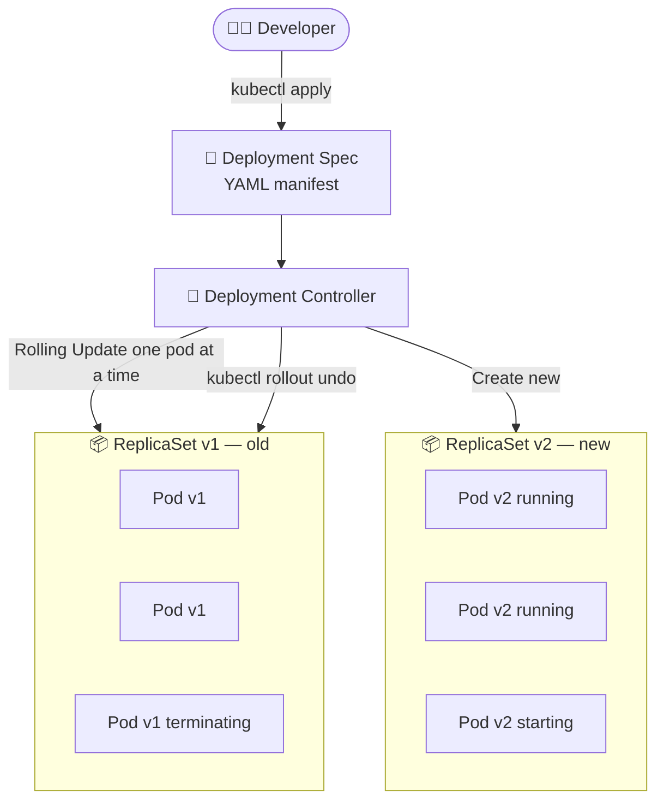
```mermaid
flowchart TB
    Dev(["👩‍💻 Developer"])
    Spec["📄 Deployment Spec\nYAML manifest"]
    DC["🚀 Deployment Controller"]

    subgraph RS_V1["📦 ReplicaSet v1 — old"]
        P1v1["Pod v1"]
        P2v1["Pod v1"]
        P3v1["Pod v1 terminating"]
    end

    subgraph RS_V2["📦 ReplicaSet v2 — new"]
        P1v2["Pod v2 running"]
        P2v2["Pod v2 running"]
        P3v2["Pod v2 starting"]
    end

    Dev -->|"kubectl apply"| Spec
    Spec --> DC
    DC -->|"Rolling Update one pod at a time"| RS_V1
    DC -->|"Create new"| RS_V2
    DC -->|"kubectl rollout undo"| RS_V1
```

### Deployment Use Cases

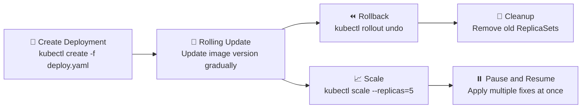
```mermaid
flowchart LR
    A["📄 Create Deployment\nkubectl create -f deploy.yaml"]
    B["🔄 Rolling Update\nUpdate image version gradually"]
    C["⏪ Rollback\nkubectl rollout undo"]
    D["📈 Scale\nkubectl scale --replicas=5"]
    E["⏸️ Pause and Resume\nApply multiple fixes at once"]
    F["🧹 Cleanup\nRemove old ReplicaSets"]

    A --> B --> C
    B --> D
    D --> E
    C --> F
```

### Key Commands

```bash
# Create & Apply
kubectl create -f nginx-deploy.yaml
kubectl apply  -f nginx-deploy.yaml

# Inspect
kubectl get deploy
kubectl describe deploy mydeployment
kubectl get rs

# Scale
kubectl scale --replicas=5 deploy mydeployment

# Rollout Management
kubectl rollout status   deployment mydeployment
kubectl rollout history  deployment mydeployment
kubectl rollout undo     deploy/mydeployment
kubectl rollout undo     deploy/mydeployment --to-revision=2
```

> 📌 **ReplicaSet naming format:** `[Deployment-name]-[Random-String]`

### Deployment Status Fields

| Field | Description |
|-------|-------------|
| `NAME` | Deployment name in namespace |
| `READY` | `ready/desired` replica count |
| `UP-TO-DATE` | Replicas updated to desired state |
| `AVAILABLE` | Replicas available to users |
| `AGE` | Time since deployment was created |

---

## 🌐 Services

> A Service is a **stable network endpoint** that exposes Pods. It acts as a **round-robin load balancer** monitoring pods and routing traffic only to healthy ones.

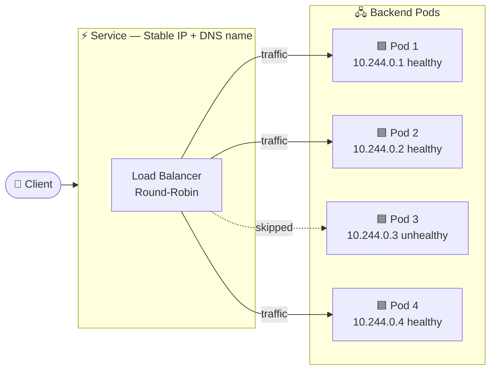
```mermaid
flowchart LR
    Client(["👤 Client"])

    subgraph SVC["⚡ Service — Stable IP + DNS name"]
        LB["Load Balancer\nRound-Robin"]
    end

    subgraph Pods["🖧 Backend Pods"]
        P1["🟦 Pod 1\n10.244.0.1  healthy"]
        P2["🟦 Pod 2\n10.244.0.2  healthy"]
        P3["🟦 Pod 3\n10.244.0.3  unhealthy"]
        P4["🟦 Pod 4\n10.244.0.4  healthy"]
    end

    Client --> SVC
    LB -->|"traffic"| P1
    LB -->|"traffic"| P2
    LB -.->|"skipped"| P3
    LB -->|"traffic"| P4
```

### Service Types

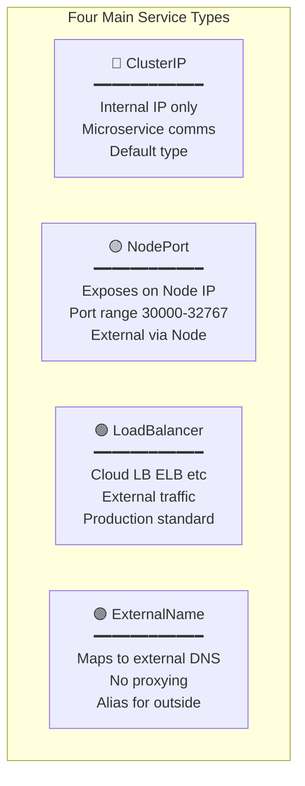
```mermaid
graph TB
    subgraph Types["Four Main Service Types"]
        direction LR

        CIP["🔵 ClusterIP\n━━━━━━━━━━━━\nInternal IP only\nMicroservice comms\nDefault type"]

        NP["🟡 NodePort\n━━━━━━━━━━━━\nExposes on Node IP\nPort range 30000-32767\nExternal via Node"]

        LB["🟢 LoadBalancer\n━━━━━━━━━━━━\nCloud LB  ELB etc\nExternal traffic\nProduction standard"]

        EN["🟣 ExternalName\n━━━━━━━━━━━━\nMaps to external DNS\nNo proxying\nAlias for outside"]
    end
```

### NodePort Architecture

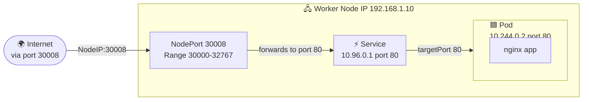
```mermaid
graph LR
    Internet(["🌍 Internet\nvia port 30008"])

    subgraph Node["🖧 Worker Node  IP 192.168.1.10"]
        NP["NodePort 30008\nRange 30000-32767"]
        subgraph SVC["⚡ Service\n10.96.0.1 port 80"]
        end
        subgraph Pod["🟦 Pod\n10.244.0.2 port 80"]
            App["nginx app"]
        end
    end

    Internet -->|"NodeIP:30008"| NP
    NP -->|"forwards to port 80"| SVC
    SVC -->|"targetPort 80"| Pod
```

```yaml
apiVersion: v1
kind: Service
metadata:
  name: myapp-service
spec:
  type: NodePort
  selector:
    app: web
  ports:
    - targetPort: 80   # Port on the Pod
      port: 80         # Port on the Service
      nodePort: 30008  # Port on the Node (30000-32767)
```

### ClusterIP — Microservices Architecture

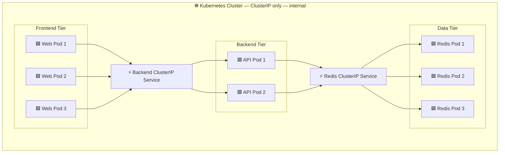
```mermaid
graph TB
    subgraph Cluster["☸️ Kubernetes Cluster — ClusterIP only — internal"]

        subgraph FE["Frontend Tier"]
            W1["🟦 Web Pod 1"]
            W2["🟦 Web Pod 2"]
            W3["🟦 Web Pod 3"]
        end

        BE_SVC["⚡ Backend ClusterIP Service"]

        subgraph BE["Backend Tier"]
            B1["🟦 API Pod 1"]
            B2["🟦 API Pod 2"]
        end

        DB_SVC["⚡ Redis ClusterIP Service"]

        subgraph DB["Data Tier"]
            R1["🟦 Redis Pod 1"]
            R2["🟦 Redis Pod 2"]
            R3["🟦 Redis Pod 3"]
        end
    end

    W1 & W2 & W3 --> BE_SVC
    BE_SVC --> B1 & B2
    B1 & B2 --> DB_SVC
    DB_SVC --> R1 & R2 & R3
```

---

## 🔀 Ingress

> **Ingress** manages **external HTTP/HTTPS access** to services. It provides path-based routing, SSL termination, and name-based virtual hosting.

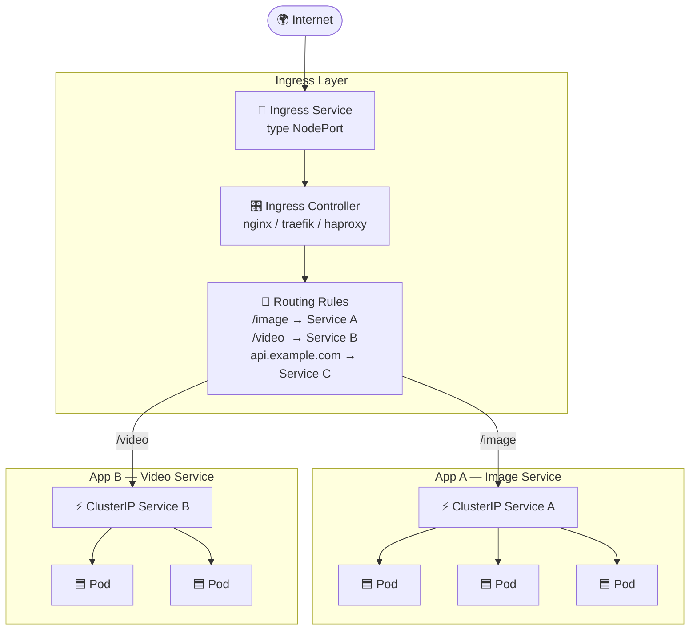
```mermaid
flowchart TB
    Internet(["🌍 Internet"])

    subgraph Ingress_Layer["Ingress Layer"]
        IGS["🔌 Ingress Service\ntype NodePort"]
        IGC["🎛️ Ingress Controller\nnginx / traefik / haproxy"]
        Rules["📜 Routing Rules\n/image → Service A\n/video  → Service B\napi.example.com → Service C"]
    end

    subgraph ServiceA["App A — Image Service"]
        SA["⚡ ClusterIP Service A"]
        PA1["🟦 Pod"] & PA2["🟦 Pod"] & PA3["🟦 Pod"]
    end

    subgraph ServiceB["App B — Video Service"]
        SB["⚡ ClusterIP Service B"]
        PB1["🟦 Pod"] & PB2["🟦 Pod"]
    end

    Internet --> IGS --> IGC --> Rules
    Rules -->|"/image"| SA
    Rules -->|"/video"| SB
    SA --> PA1 & PA2 & PA3
    SB --> PB1 & PB2
```

```yaml
apiVersion: networking.k8s.io/v1
kind: Ingress
metadata:
  name: my-ingress
  annotations:
    nginx.ingress.kubernetes.io/rewrite-target: /
spec:
  rules:
    - host: myapp.example.com
      http:
        paths:
          - path: /image
            pathType: Prefix
            backend:
              service:
                name: image-service
                port:
                  number: 80
          - path: /video
            pathType: Prefix
            backend:
              service:
                name: video-service
                port:
                  number: 80
```

---

## 🔁 Scaling & ReplicaSets

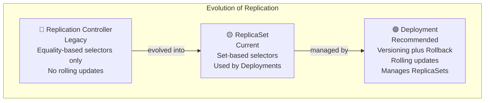
```mermaid
graph TB
    subgraph Evolution["Evolution of Replication"]
        RC["🔵 Replication Controller\nLegacy\nEquality-based selectors only\nNo rolling updates"]
        RS["🟡 ReplicaSet\nCurrent\nSet-based selectors\nUsed by Deployments"]
        Deploy["🟢 Deployment\nRecommended\nVersioning plus Rollback\nRolling updates\nManages ReplicaSets"]
    end
    RC -->|"evolved into"| RS
    RS -->|"managed by"| Deploy
```

### Why Replicate?

| Benefit | Description |
|---------|-------------|
| **Reliability** | Multiple pod copies — no single-point failure |
| **Load Balancing** | Traffic distributed across all instances |
| **Scaling** | Add replicas when load increases |
| **Rolling Updates** | Update pods one by one — zero downtime |

### ReplicaSet Self-Healing

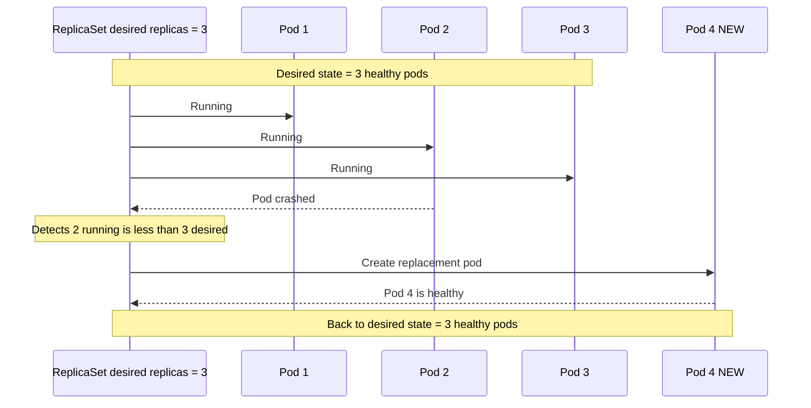
```mermaid
sequenceDiagram
    participant RS as ReplicaSet  desired replicas = 3
    participant P1 as Pod 1
    participant P2 as Pod 2
    participant P3 as Pod 3
    participant P4 as Pod 4 NEW

    Note over RS,P3: Desired state = 3 healthy pods

    RS->>P1: Running
    RS->>P2: Running
    RS->>P3: Running

    P2-->>RS: Pod crashed

    Note over RS: Detects 2 running is less than 3 desired

    RS->>P4: Create replacement pod
    P4-->>RS: Pod 4 is healthy

    Note over RS,P4: Back to desired state = 3 healthy pods
```

### RC vs ReplicaSet vs Deployment

| Feature | Replication Controller | ReplicaSet | Deployment |
|---------|----------------------|------------|------------|
| **Selectors** | Equality-based only | Set-based | Set-based |
| **Rolling updates** | No | No | Yes |
| **Rollback** | No | No | Yes |
| **Used by** | Legacy | ReplicaSet | Current standard |

---

## 🌐 Kubernetes Networking

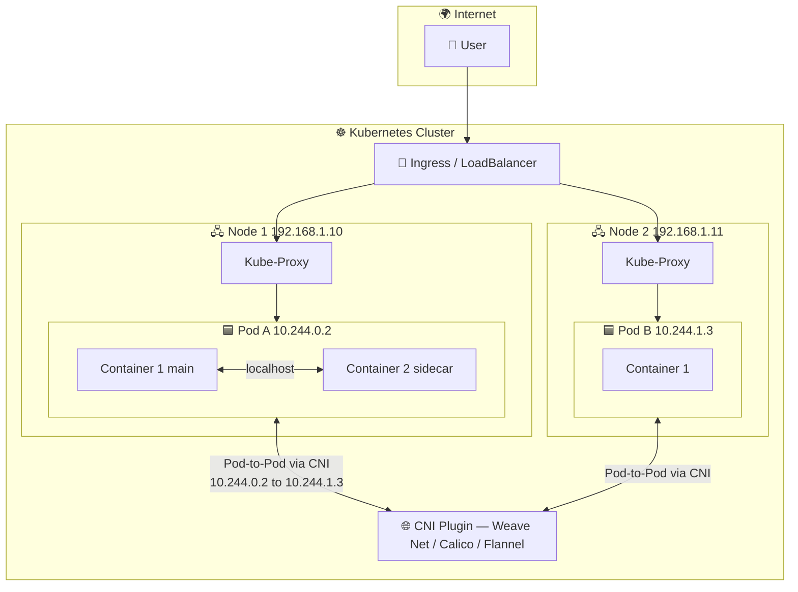
```mermaid
graph TB
    subgraph Internet["🌍 Internet"]
        Client["👤 User"]
    end

    subgraph Cluster["☸️ Kubernetes Cluster"]

        Ingress["🔀 Ingress / LoadBalancer"]

        subgraph Node1["🖧 Node 1  192.168.1.10"]
            KP1["Kube-Proxy"]
            subgraph Pod_A["🟦 Pod A  10.244.0.2"]
                ContA1["Container 1  main"]
                ContA2["Container 2  sidecar"]
            end
        end

        subgraph Node2["🖧 Node 2  192.168.1.11"]
            KP2["Kube-Proxy"]
            subgraph Pod_B["🟦 Pod B  10.244.1.3"]
                ContB1["Container 1"]
            end
        end

        subgraph CNI["🌐 CNI Plugin — Weave Net / Calico / Flannel"]
        end
    end

    Client --> Ingress
    Ingress --> KP1 & KP2
    KP1 --> Pod_A
    KP2 --> Pod_B
    ContA1 <-->|"localhost"| ContA2
    Pod_A <-->|"Pod-to-Pod via CNI\n10.244.0.2 to 10.244.1.3"| CNI
    Pod_B <-->|"Pod-to-Pod via CNI"| CNI
```

### Four Networking Concerns

| Communication | Mechanism | Example |
|---------------|-----------|---------|
| **Container to Container** | `localhost` within same pod | app + sidecar |
| **Pod to Pod** | CNI network (Weave / Calico) | frontend to backend |
| **Pod to Service** | kube-proxy + ClusterIP | app to database service |
| **External to Service** | NodePort / LoadBalancer / Ingress | user to web app |

---

## 💾 Volumes & Storage

> Containers are **ephemeral** — data is lost on crash. Kubernetes **Volumes** persist data across container restarts within the same Pod lifetime.

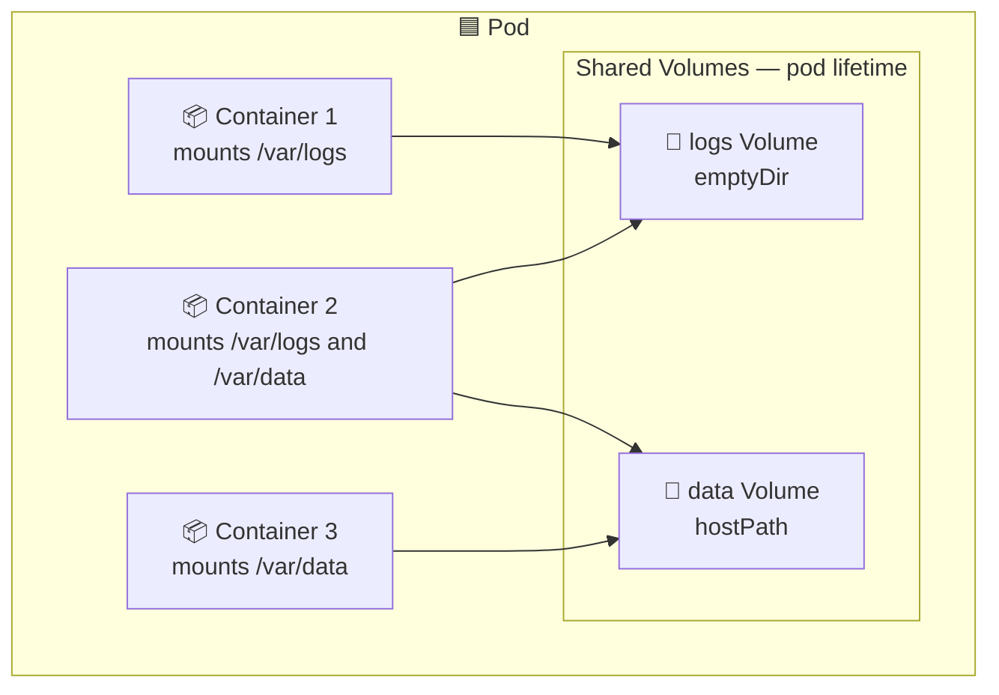
```mermaid
graph TB
    subgraph Pod["🟦 Pod"]
        C1["📦 Container 1\nmounts /var/logs"]
        C2["📦 Container 2\nmounts /var/logs and /var/data"]
        C3["📦 Container 3\nmounts /var/data"]

        subgraph Volumes["Shared Volumes — pod lifetime"]
            V1["📂 logs Volume\nemptyDir"]
            V2["📂 data Volume\nhostPath"]
        end
    end

    C1 --> V1
    C2 --> V1
    C2 --> V2
    C3 --> V2
```

### Volume Types

| Type | Scope | Use Case | Notes |
|------|-------|----------|-------|
| `emptyDir` | Pod lifetime | Share data between containers in same pod | Deleted when pod is removed |
| `hostPath` | Node filesystem | Access host machine files | Different data per node |
| `nfs` | Network | Shared file access across nodes | Requires NFS server |
| `configMap` | Cluster | Config files as volumes | Read-only config data |
| `secret` | Cluster | Sensitive data as files | Stored in tmpfs on nodes |
| `persistentVolumeClaim` | Cluster | Long-term storage | Outlives pods |
| `awsElasticBlockStore` | Cloud AWS | Persistent cloud storage | AZ-specific |
| `azureDisk` | Cloud Azure | Persistent cloud storage | Zone-specific |
| `gcePersistentDisk` | Cloud GCP | Persistent cloud storage | Zone-specific |

---

## 🗂️ Persistent Volumes

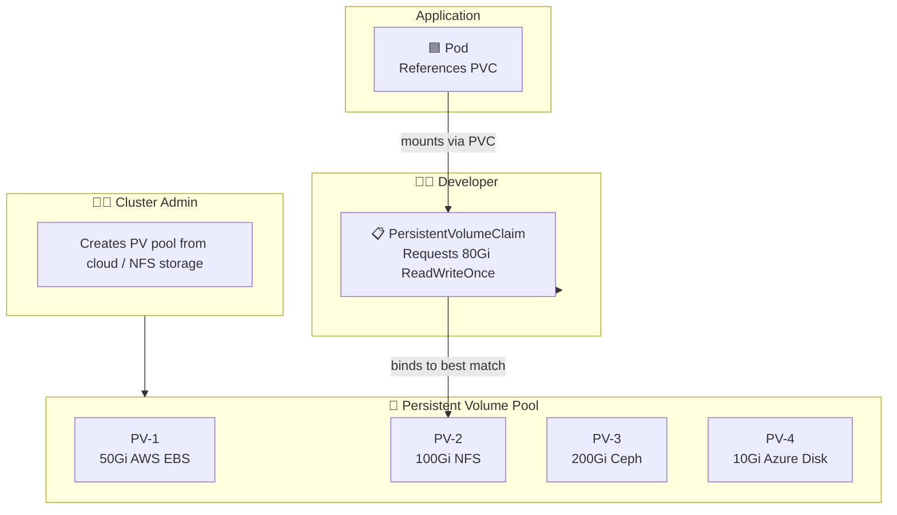
```mermaid
flowchart TB
    subgraph Admin["👨‍💼 Cluster Admin"]
        A["Creates PV pool from cloud / NFS storage"]
    end

    subgraph PV_Pool["💾 Persistent Volume Pool"]
        PV1["PV-1\n50Gi AWS EBS"]
        PV2["PV-2\n100Gi NFS"]
        PV3["PV-3\n200Gi Ceph"]
        PV4["PV-4\n10Gi Azure Disk"]
    end

    subgraph Dev["👩‍💻 Developer"]
        PVC["📋 PersistentVolumeClaim\nRequests 80Gi ReadWriteOnce"]
    end

    subgraph App["Application"]
        Pod["🟦 Pod\nReferences PVC"]
    end

    Admin --> PV_Pool
    Dev --> PVC
    PVC -->|"binds to best match"| PV2
    Pod -->|"mounts via PVC"| PVC
```

### PV Access Modes

| Mode | Short | Description |
|------|-------|-------------|
| `ReadWriteOnce` | RWO | Single node read-write |
| `ReadOnlyMany` | ROX | Multiple nodes read-only |
| `ReadWriteMany` | RWX | Multiple nodes read-write |
| `ReadWriteOncePod` | RWOP | Single pod read-write (K8s 1.22+) |

### PV Reclaim Policies

| Policy | Behavior |
|--------|----------|
| `Retain` | Keep PV data after PVC deleted — manual cleanup |
| `Delete` | Auto-delete underlying storage resource |
| `Recycle` | Scrub data and make PV available again — deprecated |

```yaml
# persistent-volume.yaml
apiVersion: v1
kind: PersistentVolume
metadata:
  name: my-pv
spec:
  capacity:
    storage: 100Gi
  accessModes:
    - ReadWriteOnce
  persistentVolumeReclaimPolicy: Retain
  storageClassName: standard
  awsElasticBlockStore:
    volumeID: vol-0123456789abcdef0
    fsType: ext4
---
apiVersion: v1
kind: PersistentVolumeClaim
metadata:
  name: my-pvc
spec:
  accessModes:
    - ReadWriteOnce
  resources:
    requests:
      storage: 80Gi
  storageClassName: standard
```

---

## 🗂️ Namespaces

> A **Namespace** is a virtual cluster inside a physical Kubernetes cluster. It provides isolation, authorization boundaries, and resource quotas.

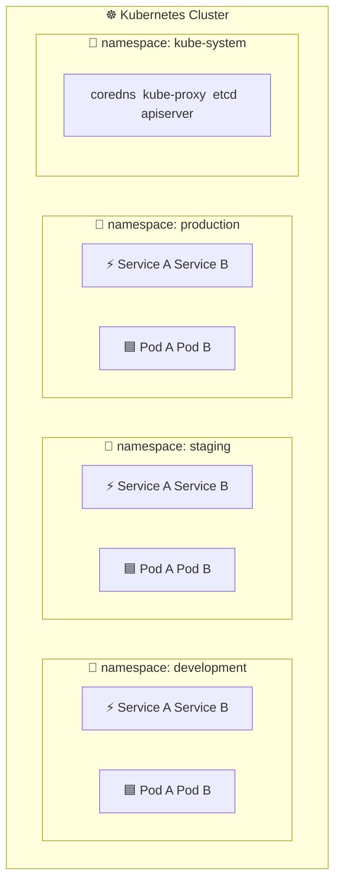
```mermaid
graph TB
    subgraph Cluster["☸️ Kubernetes Cluster"]

        subgraph NS_DEV["📁 namespace: development"]
            direction LR
            DEV_SVC["⚡ Service A  Service B"]
            DEV_PODS["🟦 Pod A  Pod B"]
        end

        subgraph NS_STAGE["📁 namespace: staging"]
            direction LR
            STG_SVC["⚡ Service A  Service B"]
            STG_PODS["🟦 Pod A  Pod B"]
        end

        subgraph NS_PROD["📁 namespace: production"]
            direction LR
            PRD_SVC["⚡ Service A  Service B"]
            PRD_PODS["🟦 Pod A  Pod B"]
        end

        subgraph NS_SYS["📁 namespace: kube-system"]
            SYS["coredns  kube-proxy  etcd  apiserver"]
        end
    end
```

```bash
kubectl create namespace production
kubectl get pods -n production
kubectl get all -n development
kubectl config set-context --current --namespace=production
```

```yaml
apiVersion: v1
kind: Namespace
metadata:
  name: production
  labels:
    env: prod
    team: backend
```

---

## 🏷️ Labels & Selectors

```mermaid
graph TB
    subgraph All_Pods["All Pods in Cluster"]
        P1["🟦 Pod\napp=web\nenv=prod"]
        P2["🟦 Pod\napp=api\nenv=prod"]
        P3["🟦 Pod\napp=web\nenv=dev"]
        P4["🟦 Pod\napp=db\nenv=prod"]
        P5["🟦 Pod\napp=api\nenv=dev"]
    end

    SEL1["🔍 Selector env=prod"]
    SEL2["🔍 Selector app=web"]

    SEL1 -->|"matches"| P1
    SEL1 -->|"matches"| P2
    SEL1 -->|"matches"| P4

    SEL2 -->|"matches"| P1
    SEL2 -->|"matches"| P3
```

### Label Selector Types

| Type | Operators | Example |
|------|-----------|---------|
| **Equality-based** | `=`, `==`, `!=` | `env=production` |
| **Set-based** | `in`, `notin`, `exists` | `env in (prod, staging)` |

```bash
kubectl label nodes node-1 hardware=gpu
kubectl get pods --show-labels
kubectl get pods -l env=production
kubectl get pods -l 'env in (production, staging)'
```

---

## 🔐 Secrets & ConfigMaps

```mermaid
graph LR
    subgraph Sources["Data Sources"]
        TF["📄 Text File\n--from-file"]
        LIT["⌨️ Literal\n--from-literal"]
        YML["📋 YAML\nkubectl apply"]
    end

    subgraph Secrets["🔐 Secrets in etcd\nbase64 encoded"]
        DB_PASS["DB_PASSWORD"]
        API_KEY["API_KEY"]
        TLS["TLS cert and key"]
    end

    subgraph CM["⚙️ ConfigMaps in etcd\nplain text"]
        APP_CFG["app.config"]
        DB_HOST["DB_HOST=mysql"]
        LOG_LVL["LOG_LEVEL=info"]
    end

    subgraph Pods["🟦 Pods"]
        ENV["As Environment Variables"]
        VOL["As Volume mounted files"]
    end

    Sources --> Secrets & CM
    Secrets & CM --> ENV & VOL
```

| | **Secret** | **ConfigMap** |
|--|-----------|--------------|
| **Data type** | Sensitive — passwords, keys, certs | Non-sensitive config |
| **Storage** | base64-encoded in etcd | Plain text in etcd |
| **Node storage** | `tmpfs` — not written to disk | Regular storage |
| **Size limit** | **1 MB** per secret | **1 MB** per configmap |
| **Access** | Env vars or volume mounts | Env vars or volume mounts |

```bash
kubectl create secret generic db-secret \
  --from-literal=DB_PASSWORD=s3cr3t \
  --from-literal=DB_USER=admin

kubectl create configmap app-config \
  --from-literal=LOG_LEVEL=info \
  --from-file=app.properties
```

---

## 🔄 Pod Lifecycle

```mermaid
stateDiagram-v2
    [*] --> Pending : kubectl apply

    Pending --> Running : All containers started successfully
    Pending --> Failed : Container failed to start

    Running --> Succeeded : All containers exit with code 0
    Running --> Failed : One or more containers exit non-zero
    Running --> Unknown : Node communication lost

    Failed --> [*] : Pod terminated
    Succeeded --> [*] : Pod completed
    Unknown --> Running : Node recovers
    Unknown --> [*] : Pod deleted
```

### Pod Phase Descriptions

| Phase | Description |
|-------|-------------|
| **Pending** | Accepted by cluster — containers not yet started |
| **Running** | At least one container is actively executing |
| **Succeeded** | All containers terminated with exit code 0 |
| **Failed** | One or more containers exited with non-zero status |
| **Unknown** | Pod state cannot be determined — node issue |

### Health Probes

```yaml
spec:
  containers:
    - name: web-app
      image: nginx
      livenessProbe:          # Is container alive? Restart if fail
        httpGet:
          path: /healthz
          port: 8080
        initialDelaySeconds: 15
        periodSeconds: 20
      readinessProbe:         # Is container ready for traffic?
        httpGet:
          path: /ready
          port: 8080
        initialDelaySeconds: 5
        periodSeconds: 10
      startupProbe:           # Has slow container started?
        httpGet:
          path: /started
          port: 8080
        failureThreshold: 30
        periodSeconds: 10
```

---

## 📦 Kubernetes Objects

```mermaid
graph TB
    subgraph K8s_Objects["☸️ Kubernetes Object Relationships"]
        Deploy["🚀 Deployment\nmanages updates and rollbacks"]
        RS["🔁 ReplicaSet\nmaintains desired pod count"]
        Pod["🟦 Pod\ngroup of containers"]
        Containers["📦 Containers\nDocker / containerd"]
        Svc["⚡ Service\nexposes pods via stable IP"]
        CM2["⚙️ ConfigMap\nnon-sensitive config data"]
        Secret["🔐 Secret\nsensitive data"]
        Ingress["🔀 Ingress\nHTTP routing rules"]
        PVC["📋 PVC\nstorage claim"]
        PV["💾 PV\nactual storage backend"]
        NS["📁 Namespace\nisolation boundary"]
    end

    Deploy -->|"manages"| RS
    RS -->|"creates and deletes"| Pod
    Pod -->|"runs"| Containers
    Svc -->|"selects via labels"| Pod
    Ingress -->|"routes to"| Svc
    CM2 -->|"configures"| Pod
    Secret -->|"mounts into"| Pod
    PVC -->|"binds to"| PV
    Pod -->|"claims"| PVC
    NS -->|"scopes all objects"| Deploy
```

> Every Kubernetes object has:
> - **`spec`** — desired state (you define this)
> - **`status`** — actual state (Kubernetes updates this)
> - **Unique name + UID** within its namespace
> - Represented as **JSON or YAML** files

---

## ⛵ Helm CheatSheet

> **Helm** is the package manager for Kubernetes — like `apt` or `brew` for K8s apps. A **Chart** is a package, a **Release** is a deployed instance.

```mermaid
graph LR
    Dev(["👩‍💻 Developer"])
    Repo["📦 Helm Repository\nchart registry"]
    Chart["📋 Chart\ntemplates plus values"]
    Render["⚙️ Helm Template Engine"]
    K8s["☸️ Kubernetes API Server"]
    Release["🚀 Release\nrunning instance"]

    Dev -->|"helm repo add"| Repo
    Repo -->|"helm pull"| Chart
    Dev -->|"helm install"| Chart
    Chart --> Render
    Render -->|"generates manifests"| K8s
    K8s --> Release
    Dev -->|"helm upgrade"| Release
    Dev -->|"helm rollback"| Release
```

### Repository Management

| Command | Description |
|---------|-------------|
| `helm repo add <n> <url>` | Add a chart repository |
| `helm repo list` | List all added repositories |
| `helm repo update` | Refresh local chart cache |
| `helm repo remove <n>` | Remove a repository |
| `helm search repo` | List all available charts |
| `helm search repo <keyword>` | Search for a specific chart |

### Installing Charts

| Command | Description |
|---------|-------------|
| `helm install <n> <chart>` | Install chart with a name |
| `helm install <chart> --generate-name` | Auto-generate release name |
| `helm install <n> <chart> -n <ns>` | Install in specific namespace |
| `helm install <n> <chart> --set key=val` | Override specific values |
| `helm install <n> <chart> -f values.yaml` | Override with values file |
| `helm install <n> <chart> --dry-run --debug` | Test without deploying |
| `helm install <n> <chart> --verify` | Verify chart before install |
| `helm uninstall <n>` | Uninstall a release |
| `helm uninstall <n> --keep-history` | Uninstall but keep history |

### Managing Releases

| Command | Description |
|---------|-------------|
| `helm list` | List releases in current namespace |
| `helm list --all-namespaces` | List all releases everywhere |
| `helm list --date` | Sort releases by date |
| `helm status <n>` | Show release status |
| `helm upgrade <n> <chart>` | Upgrade a release |
| `helm upgrade <n> <chart> --atomic` | Atomic upgrade — rollback on fail |
| `helm rollback <release> <revision>` | Rollback to a specific revision |

### Developing Charts

| Command | Description |
|---------|-------------|
| `helm create <n>` | Scaffold a new chart |
| `helm package <chart-path>` | Package chart as .tgz file |
| `helm lint <chart>` | Validate chart syntax |
| `helm show all <chart>` | Show all chart info |
| `helm show values <chart>` | Show default values |
| `helm template <n> <chart>` | Render templates locally |

### Global Flags

| Flag | Description |
|------|-------------|
| `--kube-context <n>` | Kubernetes context to use |
| `--namespace <n>` | Namespace for this operation |
| `--kubeconfig <path>` | Path to kubeconfig file |
| `-f, --values <file>` | Values file override |

---

## ⌨️ kubectl Quick Reference

```bash
# PODS
kubectl get pods                              # List all pods
kubectl get pods -A                           # All namespaces
kubectl get pods -o wide                      # With node and IP info
kubectl describe pod <n>                   # Detailed pod info
kubectl logs <pod>                            # View pod logs
kubectl logs <pod> -f                         # Stream logs
kubectl exec -it <pod> -- /bin/bash           # Shell into pod
kubectl delete pod <n>                     # Delete a pod
kubectl top pod                               # CPU and memory usage

# DEPLOYMENTS
kubectl create -f deploy.yaml                 # Create from file
kubectl apply  -f deploy.yaml                 # Create or update
kubectl get deploy                            # List deployments
kubectl scale deploy <n> --replicas=5      # Scale
kubectl set image deploy/<n> img=img:v2    # Update image
kubectl rollout status  deploy/<n>         # Watch rollout
kubectl rollout history deploy/<n>         # View history
kubectl rollout undo    deploy/<n>         # Rollback 1 step
kubectl rollout undo    deploy/<n> --to-revision=2

# SERVICES
kubectl get svc                               # List services
kubectl describe svc <n>                   # Service details
kubectl expose deploy <n> --port=80 --type=NodePort

# NAMESPACES
kubectl get ns                                # List namespaces
kubectl create ns <n>                      # Create namespace
kubectl get pods -n <namespace>               # Pods in namespace

# CONFIG AND CONTEXT
kubectl config get-contexts                   # List contexts
kubectl config use-context <n>             # Switch context
kubectl config current-context               # Show current context
kubectl config set-context --current --namespace=prod

# NODES
kubectl get nodes                             # List nodes
kubectl describe node <n>                  # Node details
kubectl top nodes                             # CPU and memory
kubectl cordon <node>                         # Mark unschedulable
kubectl drain <node> --ignore-daemonsets      # Drain for maintenance

# GENERAL
kubectl apply -f ./manifests/                 # Apply all in directory
kubectl get all                               # All resources
kubectl cluster-info                          # Cluster info
kubectl api-resources                         # All resource types
kubectl explain pod.spec.containers           # Field docs
kubectl get events --sort-by=.lastTimestamp   # Recent events
```

---

<div align="center">

### 🔗 Useful Resources

[](https://kubernetes.io/docs/)
[](https://helm.sh/docs/)
[](https://landscape.cncf.io/)
[](https://www.cncf.io/certification/cka/)

---

*Notes compiled from CKA study materials — Train With Shubham*

</div>
